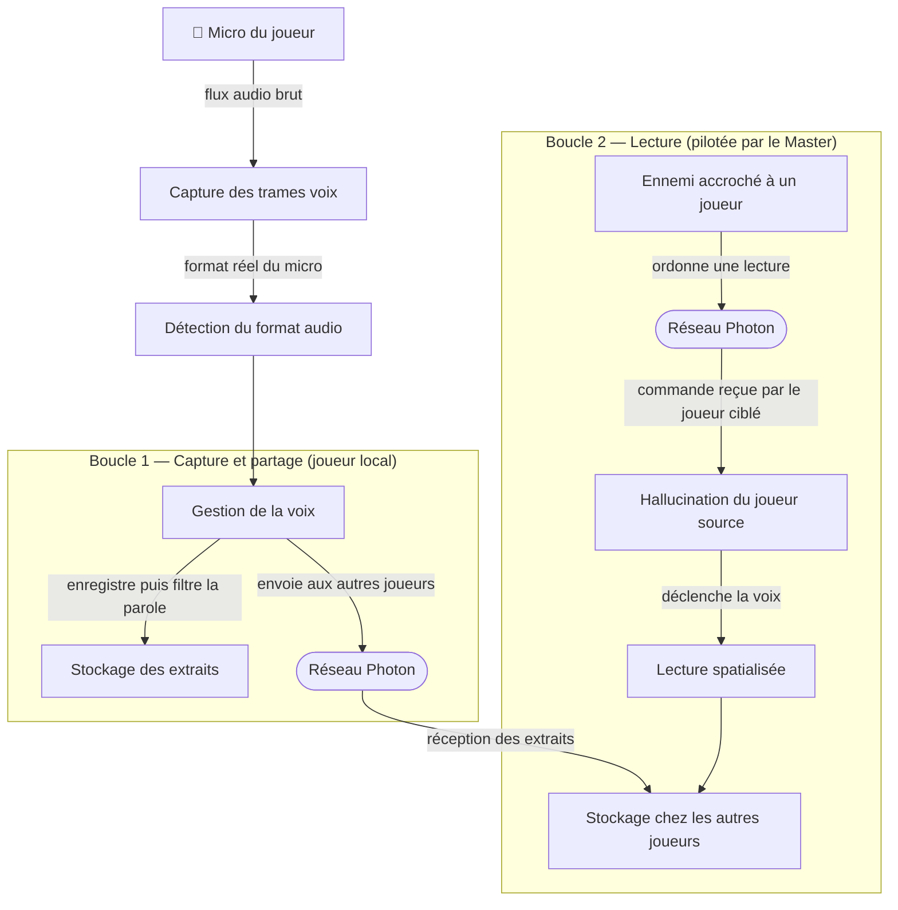
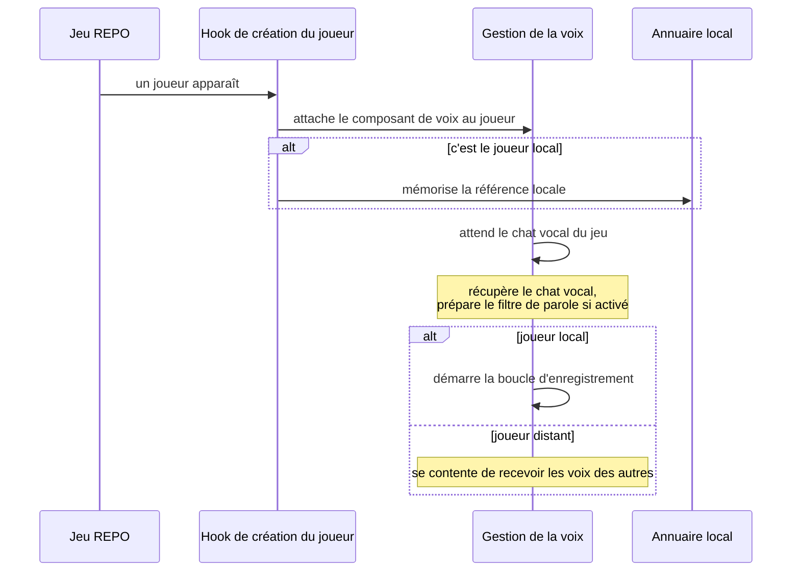
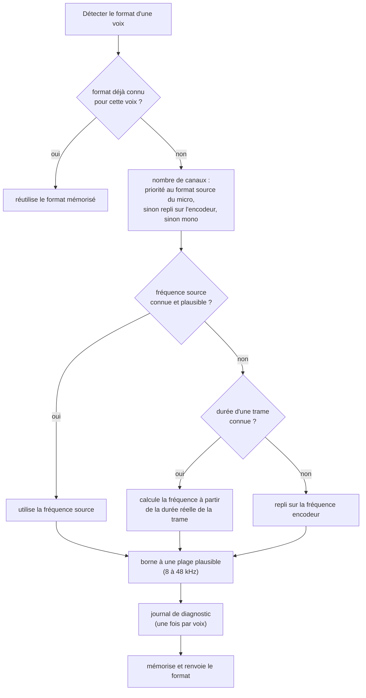
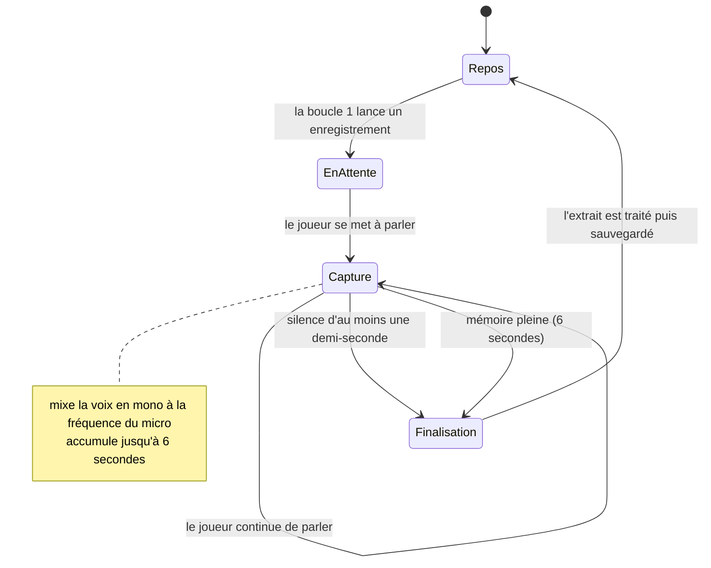
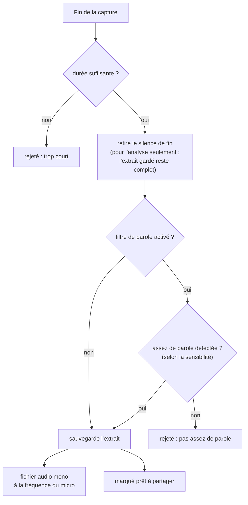
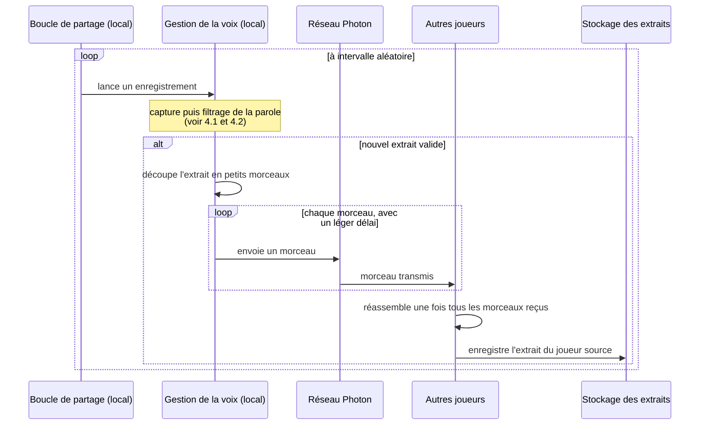
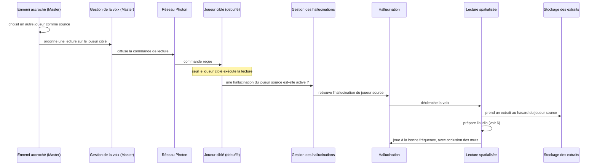
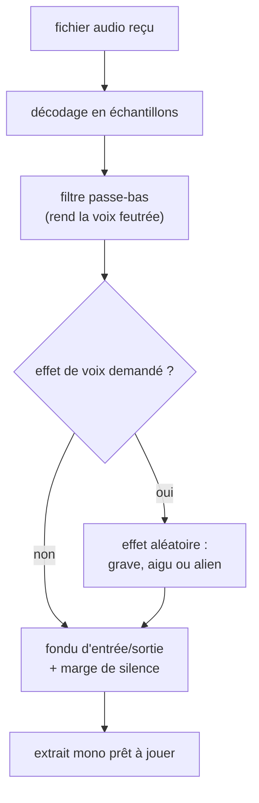

# Système de voix Whispral (Mimic) — Fonctionnement end-to-end

Documentation du pipeline complet : de la capture du micro d'un joueur jusqu'à la relecture de sa
voix par une hallucination (droid) pendant le debuff Whispral.

> Sous-systèmes détaillés ailleurs : le filtrage de parole (WebRTC VAD) est documenté dans
> [`vad-integration.md`](./vad-integration.md). Cette page couvre l'ensemble et y renvoie.

---

## 1. Vue d'ensemble

L'ennemi **Whispral** s'accroche à un joueur et le « debuff ». Pendant ce temps, des hallucinations
(des clones-droids des autres joueurs) apparaissent et **rejouent de vrais extraits de voix**
captés en jeu. Deux boucles indépendantes alimentent ça :

- **Boucle 1 — Capture & partage** : chaque client enregistre sa propre voix, la filtre (VAD),
  la sauvegarde en WAV et la partage aux autres clients.
- **Boucle 2 — Lecture** : le Master, quand un Whispral est accroché à un joueur, ordonne à ce
  joueur de jouer un extrait d'un autre joueur sur une hallucination.



**Rôle clé : `WhispralMimics`** est attaché à *chaque* `PlayerAvatar` (via
`PlayerAvatarPatch`), mais :
- la **boucle 1 d'enregistrement** ne tourne que pour le joueur **local** (`PhotonView.IsMine`) ;
- tous les clients **reçoivent et stockent** les sons des autres (pour pouvoir les rejouer) ;
- la référence au mimics local est mise en cache dans `VepFinder.LocalMimics`.

---

## 2. Initialisation & cycle de vie



---

## 3. Résolution du format audio (correctif échantillonnage)

Photon expose **deux formats** pour une voix : le format **encodeur/transmission**
(`Info.SamplingRate` / `Info.Channels`, ex. 48000 mono) et le format **source/micro**
(`InputSamplingRate` / `InputChannels`, ex. 44100 stéréo). Les buffers qu'on capture sont au format
**source** — les étiqueter avec le format encodeur déforme la voix à la relecture (pitch/vitesse).

`VoiceFormatResolver` lit donc le format **source** (par réflexion défensive, cache par voix) :



Une fois le format source correct, **tout le reste devient cohérent** : le rate voyage avec le
fichier (header WAV) et le RPC, et la lecture réutilise ce même rate. Chaque client peut donc avoir
un micro différent (16 k / 44.1 k / 48 k) sans déformation.

---

## 4. Boucle 1 — Capture, validation, partage

### 4.1 Machine d'état de la capture (`ProcessVoiceData`)

Appelée à chaque frame voix par le patch Photon (sur le **thread voix**, pas le thread Unity).



### 4.2 Pipeline de finalisation (`FinalizeRecording`)



> Détails VAD (sensibilité, seuils, fail-open, calibration) : voir
> [`vad-integration.md`](./vad-integration.md).

### 4.3 Partage réseau



Le `WavFileManager` applique une **rotation** par joueur (max `ConfigSamplesPerPlayer`, supprime le
plus ancien).

---

## 5. Boucle 2 — Lecture sur l'hallucination

Pilotée par le **Master**. Quand `EnemyWhispral` est dans l'état `Attached` à un joueur, il envoie
périodiquement (toutes les `VoiceDelay.Min..Max` s) une commande de lecture.



---

## 6. Traitement audio

### 6.1 À la capture (boucle 1)
- **Downmix → mono** par moyenne des canaux (`CopyVoiceDataToBuffer`).
- **VAD** (filtre principal de parole) — voir `vad-integration.md`.
- Sauvegarde **WAV PCM 16-bit mono** au **rate source**.

### 6.2 À la lecture (boucle 2) — `ProcessReceivedAudio`


Le filtre voix aléatoire n'est appliqué que si `ConfigVoiceFilterEnabled` est activé **et** tiré au
sort (50 %). La lecture spatiale ajoute une occlusion (murs) via `AudioLowPassLogic`, comme les
vraies voix du jeu.

---

## 7. Configuration utilisateur (`BepInEx/config/com.vep.vepMod.cfg`)

| Section | Clé | Défaut | Rôle |
|---|---|---|---|
| General | `Volume` | 100 % | Volume des voix d'hallucination |
| Audio Sharing | `Share Min/Max Delay` | 10 / 30 s | Intervalle entre deux enregistrements partagés |
| Audio Sharing | `Samples Per Player` | 20 | Nb max de WAV stockés par joueur (rotation) |
| Voice Playback | `Voice Min/Max Delay` | 8 / 15 s | Intervalle entre lectures pendant le debuff |
| Voice Playback | `Voice Filter Enabled?` | false | Active les filtres voix aléatoires à la lecture |
| Audio Quality | `Min Duration` | 0.3 s | Garde-fou durée (pré-VAD) |
| Audio Quality | `VAD Enabled` | true | Active le filtrage de parole WebRTC |
| Audio Quality | `VAD Sensitivity` | Balanced | Permissive / Balanced / Strict (voir `vad-integration.md`) |
| Experimental | `Sampling Rate` | 48000 | Hint encodeur (le rate **source** réel est résolu automatiquement) |

> Variante de build **sans VAD** (`-p:VepModNoVad=true`) : retire la dépendance WebRTC et tout le
> code VAD ; la boucle 1 ne garde que le garde-fou de durée. Voir `vad-integration.md`.

---

## 8. Carte des fichiers

| Fichier | Rôle |
|---|---|
| `src/VepMod.cs` | Plugin BepInEx : config, Harmony, préchargement prefab |
| `src/Patchs/PlayerAvatarPatch.cs` | Attache `WhispralMimics` ; définit `VepFinder.LocalMimics` |
| `src/Patchs/LocalVoiceFramedPatch.cs` | Capte les frames micro → `ProcessVoiceData` |
| `src/Patchs/VoiceFormatResolver.cs` | Résout le format **source** (rate + canaux) |
| `src/Patchs/VepFinder.cs` | Cache global du `WhispralMimics` local |
| `src/Enemies/Whispral/WhispralMimics.cs` | Cœur : capture, VAD, partage (L1), réception, lecture (L2) |
| `src/Enemies/Whispral/WavFileManager.cs` | Stockage WAV par joueur + rotation |
| `src/Enemies/Whispral/AudioFilters.cs` | Conversions, passe-bas, pitch, alien, fade/padding |
| `src/VepFramework/Audio/VadAudioValidator.cs` | Filtre de parole WebRTC VAD |
| `src/Enemies/Whispral/EnemyWhispral.cs` | FSM de l'ennemi ; envoie les commandes de lecture (L2) |
| `src/Enemies/Whispral/DroidController.cs` | Hallucination ; `PlayVoice` → lecture sur le droid |
| `src/Dev/DroidDevTools.cs` | Outils dev (DEBUG) : spawn droid, F6 replay VAD, HUD |
```
